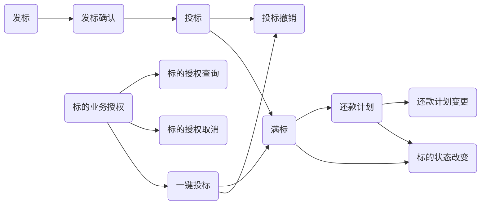

## 这是Typora风格

### 第一组

1. description 1
2. description 2
3. description 3

### 第二组

1. description 2_1
2. description 2_2

## vs2015key

```
Visual Studio Professional 2015

Key : HMGNV-WCYXV-X7G9W-YCX63-B98R2

Visual Studio Enterprise 2015

Key :HM6NR-QXX7C-DFW2Y-8B82K-WTYJV

Visual Studio Enterprise 2015

Key :2XNFG-KFHR8-QV3CP-3W6HT-683CH
```

## mermaid测试



