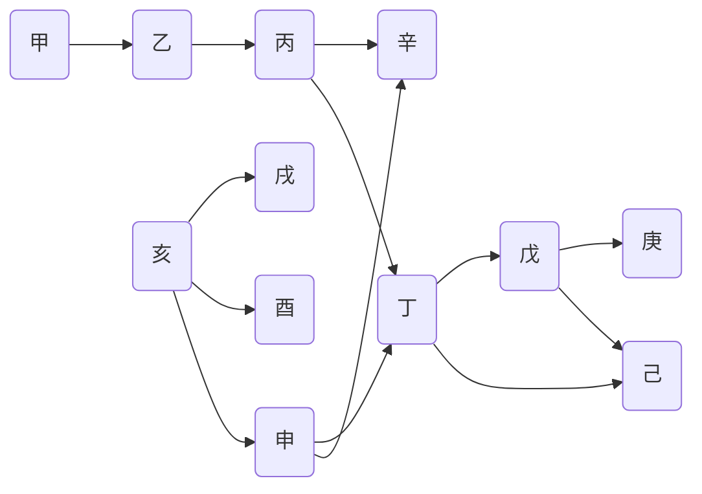

[TOC]

## vs2015key

```
Visual Studio Professional 2015

Key : HMGNV-WCYXV-X7G9W-YCX63-B98R2

Visual Studio Enterprise 2015

Key :HM6NR-QXX7C-DFW2Y-8B82K-WTYJV

Visual Studio Enterprise 2015

Key :2XNFG-KFHR8-QV3CP-3W6HT-683CH
```

## 分组

### 第一组

1. description 1 [^这是注释]
2. description 2 [link][]
3. ~~description~~ 3 H~2~O

### 第二组

1. **description** 2_1 
2. *description* 2_2 :happy: :cry:

### 第三组

1. description 3_1

   > - s1 
   >   $$
   >   f(x)=x^2
   >   $$
   >
   > - s2  $lim_{x \to \infty} \ exp(-x)=0$

2. description 3_2

   > this is a link [百度链接](https://www.baidu.com)
   > this is a pic 

## 流程图测试



```flow
st=>start: 开始
op=>operation: My Operation
cond=>condition: Yes or No?
e=>end
st->op->cond
cond(yes)->e
cond(no)->op
&```
```


## 代码块格式测试

1. java格式

   ```java
   public class P1 {
       public P1() {
           System.out.println("没卵用");
       }
       
       public static void main(String[] args) {
       	P1 p1 = new P1();
           System.out.println("hello world");
       }
   }
   ```

2. html

   ```html
   <html>
   	<head>This is a page</head>
   	<body>
   		<input type="text" placeholder="this is a text"></input>
   		<button>jump</button>
   	</body>
   	<foot></foot>
   </html>
   ```

3. sql

   ```mysql
   # 查询1830000的手机号，且是90后的用户
   SELECT * FROM USER u WHERE INSTR(u.`mobile_number`, '1830000') AND u.`birthday` BETWEEN '1990' AND '1999';
   ```

4. 其他

   ```json
   {
       "name":"张三",
       "sex":"男",
       "phone":"18888888888",
       "addr":"地球村"
   }
   ```

## 制表

| 学号         | 姓名 | 学分 |
| ------------ | ---- | ---- |
| 201810220001 | 鸣人 | -100 |


## 其他

[link]: http:www.baidu.com	"这是百度"

[^这是个注释]: http:www.google.com 

## 测试结果（不支持的是typora风格）

### 不支持

- toc
- 绘图
- 角标（上标、下标）
- 数学公式（flow、mermaid）
- 注释
